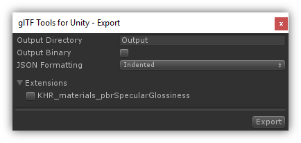

# glTF Tools for Unity

# Setup

Import <a href="./glTF-Tools-for-Unity.unitypackage">glTF-Tools-for-Unity.unitypackage</a> into your Unity project.

# Usage

1. Right-click on an asset and click on the *glTF Tools for Unity* menu.
2. Click on the *Export* item to bring up the export window. 
   
3. Choose settings and click on Export button.
